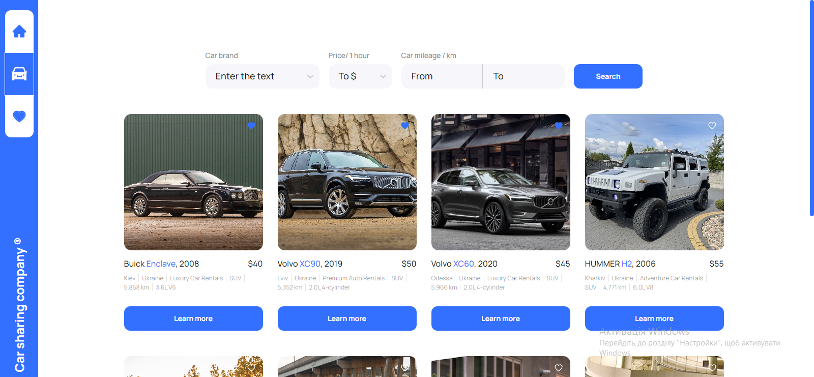
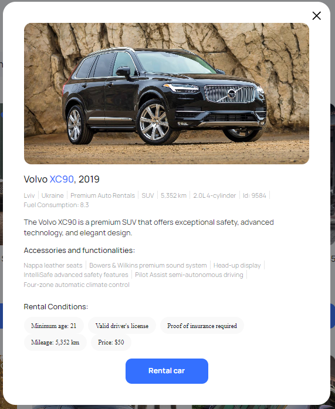
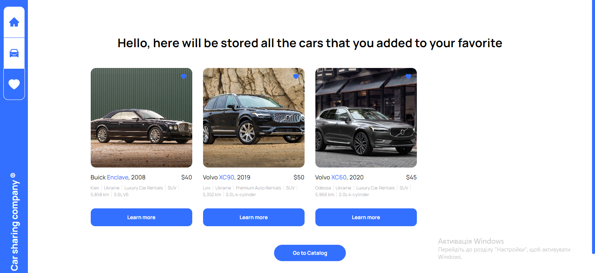

# Car Sharing Website

Welcome to the Car Sharing Website repository! This project allows you to
explore and favorite cars for car sharing.

## Features

### Car Catalog

In the Car Catalog section, you can browse a wide selection of available cars
for car sharing. Each car listing provides detailed information about the car,
including its make, model, year, and more. In the Car Catalog section, you can browse a wide selection of available cars
for car sharing. Each car listing provides detailed information about the car,
including its make, model, year, and more. You can easily filter cars by their brand, hourly rental price, and mileage to find the perfect car for your needs. 
Additionally, you can click the
"Learn More" button on any car listing to view additional details about the car.

### Car Details Modal

When you click the "Learn More" button on a car listing in the Car Catalog, a
modal window will appear with even more information about the selected car. You
can also view additional photos of the car by clicking on its image within the
modal.

### Favorites

The Favorites section allows you to keep track of your favorite cars. Simply
click the "Add to Favorites" button on any car listing, and it will be saved to
your Favorites for easy access later.

